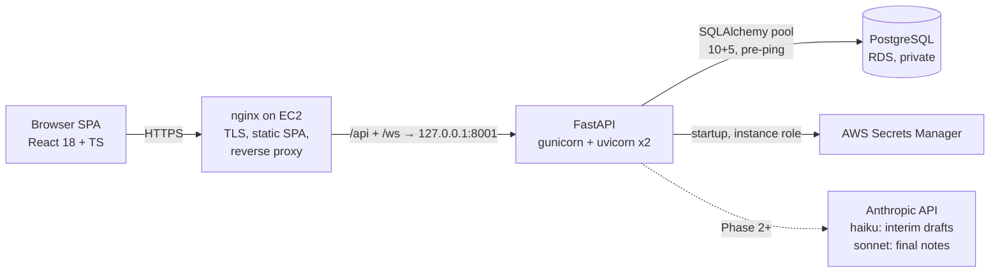

# Architecture

Living document — updated at the end of every phase, alongside
PROJECT_STRUCTURE.md and DECISIONS.md. This is the architectural source of
truth for future phases.

## System overview

- **One deployable unit**: nginx serves the built SPA and proxies `/api`
  (JSON + SSE) and `/ws` (voice edit session, Phase 8) to the backend, which
  binds 127.0.0.1 only. The DB accepts connections solely from the app's
  security group.
- **Ports**: backend is 8001 in every environment; local dev Postgres is host
  port 5433 (see DECISIONS.md for why).

## Request/data flows

**Auth (Phase 1)** — `POST /api/auth/login` verifies bcrypt hash → sets a JWT
(30-min expiry; claims: `sub`, `role`) in an httpOnly cookie. Every protected
route runs `get_current_user`: decode JWT → load user row → check `is_active`
in the DB. The fresh DB check means deactivation takes effect on the user's
very next request despite stateless tokens. The cookie deliberately outlives
the token so the server can distinguish "session expired" (401 + re-auth
modal, Phase 9) from "never logged in".

**Provider isolation (Phase 1)** — every encounter query filters
`provider_id == token user's id` server-side; the id never comes from the
client. Cross-provider reads return 404 (not 403) so encounter ids don't leak
existence. Admins see all rows.

**Note generation (Phase 2, live)** — client flushes its autosave PATCH,
then opens `GET /api/encounters/{id}/generate` (SSE). The route reads the
transcript + template instructions fresh from the DB (no cache, no push
channel — freshness by design), retrieves top-k ICD candidates (local
hashed-BoW embeddings + Python cosine over `icd_codes`), and streams
`claude-sonnet-4-6` (tier=final) or `claude-haiku-4-5` (tier=draft) through
`app/llm.py` — the single LLM gateway (60s timeout, one SDK retry,
max_tokens cap, call counter, structured errors). `app/stream_parser.py`
converts tagged sections into per-section SSE deltas; the four SOAP panes
fill incrementally. Vendor failure → `error` event → calm UI state; the
draft in the DB is untouched. `<no_clinical_content/>` → refusal event; an
empty transcript short-circuits without an LLM call.

**Persistence model** — a *draft* is an `encounters` row with `status=draft`
(DB-backed → survives refresh and works cross-device). Saving appends an
immutable `note_versions` row; versions hang directly off the encounter (no
separate notes table).

**Version history (Phase 4, live)** — the workspace's version panel lists
saved versions via `GET /api/encounters/{id}/versions` (summary rows: number,
saver, timestamp — no note body) and fetches one full version on click via
`GET /api/encounters/{id}/versions/{n}`, read fresh from RDS every time.
Nothing is ever updated or deleted in `note_versions`; the append-only
invariant is enforced by the DB (`UniqueConstraint(encounter_id,
version_number)`) and proven by an exact-value re-read test, not just a row
count.

**ICD-10 search widget (Phase 5, live)** — `GET /api/icd/search?q=<text>`
is a second, direct caller of the same `rank_candidates` function generation
uses internally: provider types a query, gets the top 5 by local
hashed-BoW-embedding cosine, and clicking a result appends
`"{code}: {description}"` into the open note's **Assessment** text. The
289-code catalog (target 250-300) is embedded once at seed time by the same
idempotent upsert script generation's candidates already relied on — no new
search infrastructure, no vendor, no vector DB.

**Admin dashboard (Phase 6, live)** — four surfaces under `/admin`
(`role == admin`, enforced server-side by `require_admin`; the client-side
`RequireAdmin` route guard is a UX nicety, not the boundary):

- **Encounters** — the SAME `GET /api/encounters` providers use, extended
  with `provider_id`/`date_from`/`date_to` query params that are only
  consulted on the admin branch of the existing isolation check. No parallel
  route, no second ownership rule to maintain.
- **Providers** — create (reuses `hash_password`/`User` as-is) and
  activate/deactivate (`PATCH /api/admin/providers/{id}`). Deactivation is
  effective on that provider's very next request — the same
  `get_current_user` DB re-check from Phase 1, unmodified.
- **Templates** — full CRUD (create + partial update; no DELETE, `is_active`
  is the soft delete so encounters keep a valid FK for history). Editing a
  template here needs **zero changes** to `generation.py`: the
  read-at-generation architecture from Phase 2 already reads
  `instructions` fresh from the DB on every generate call, so an admin edit
  simply *is* the next generation's input.
- **Audit log** — `GET /api/admin/audit`, reusing the `audit_log` table and
  `record_audit` helper from Phase 1; every mutation above writes a row in
  the same transaction as the action it records.

**Voice dictation (Phase 7, live)** — entirely client-side; no new backend
surface. `frontend/src/transcription.ts` wraps the browser's Web Speech API
behind a `TranscriptionProvider` interface (`isSupported`, `start(handlers)`,
`stop()`); `frontend/src/useDictation.ts` is the dictation state machine
(idle/listening/paused) built on top of it. Data flow:

1. **Interim/final speech → transcript buffer.** The recognizer emits interim
   text (displayed live, never persisted) and finalized chunks (appended to
   whatever the transcript buffer currently holds — including manual edits
   made between or during dictation bursts — via the existing autosave PATCH
   path, unchanged from earlier phases).
2. **Rolling regeneration.** A self-timed 1s poll fires
   `GET .../generate?tier=draft` (haiku) on a 2s pause since the last final
   chunk, or every 6s of continuous speech, whichever comes first — the exact
   SSE pipeline and stream parser from Phase 2, just invoked with `tier=draft`
   by a timer instead of a button.
3. **Final regeneration.** On Stop Dictation, one `GET .../generate` call at
   the default `tier=final` (sonnet) — same call the manual "Generate note"
   button makes.
4. **Sync guard.** Both auto-triggers above are skipped whenever the
   clinician has hand-edited a SOAP pane since the last generation
   (`noteDirty`, set on any pane's `onChange`) — checked before the
   `EventSource` even opens, so a dirty note is never silently overwritten by
   either the rolling draft or the stop-triggered final. Only the manual
   Generate button bypasses this guard.

Because dictation drives the same `generate` endpoint and stream parser every
other trigger uses, the SOAP panes, ICD candidate list, and history tool-call
flow (Phase 3) all work identically whether a generation was clicked or
auto-triggered by dictation — there is exactly one generation pipeline in
this system, not two.

## Component responsibilities

| Component | Owns |
|---|---|
| nginx | TLS, static SPA, `/api` proxy with `proxy_buffering off` (SSE), `/ws` upgrade |
| FastAPI app | auth, isolation, prompt construction, stream parsing, audit log |
| PostgreSQL | all state: users, patients, encounters, note versions, templates, ICD codes + embeddings, audit |
| Browser | Web Speech STT (dictation + voice commands), speechSynthesis TTS, SSE/WS consumption |

## Major decisions (details in DECISIONS.md)

- Two-tier models: haiku for interim dictation drafts, sonnet for final notes
  and voice edits (latency budget vs. quality budget).
- Append-only `note_versions`, no separate notes identity table.
- Template freshness by read-at-generation, not a push channel.
- ICD codes: candidate-constrained selection (model chooses from real rows we
  retrieve — codes can't be hallucinated); JSONB embeddings + Python cosine
  at ~300 rows (pgvector would be premature).
- Web Speech API is the STT baseline behind a `TranscriptionProvider`
  interface; server-side streaming STT is a stretch behind the same interface.
