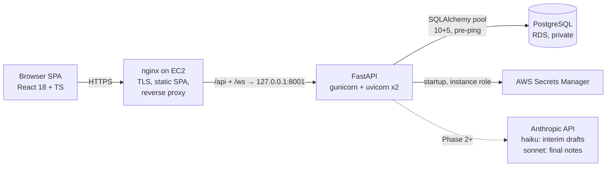

# Architecture

Living document — updated at the end of every phase, alongside
PROJECT_STRUCTURE.md and DECISIONS.md. This is the architectural source of
truth for future phases.

## System overview

- **One deployable unit**: nginx serves the built SPA and proxies `/api`
  (JSON + SSE) and `/ws` (voice edit session, Phase 8) to the backend, which
  binds 127.0.0.1 only. The DB accepts connections solely from the app's
  security group.
- **Ports**: backend is 8001 in every environment; local dev Postgres is host
  port 5433 (see DECISIONS.md for why).

## Request/data flows

**Auth (Phase 1)** — `POST /api/auth/login` verifies bcrypt hash → sets a JWT
(30-min expiry; claims: `sub`, `role`) in an httpOnly cookie. Every protected
route runs `get_current_user`: decode JWT → load user row → check `is_active`
in the DB. The fresh DB check means deactivation takes effect on the user's
very next request despite stateless tokens. The cookie deliberately outlives
the token so the server can distinguish "session expired" (401 + re-auth
modal, Phase 9) from "never logged in".

**Provider isolation (Phase 1)** — every encounter query filters
`provider_id == token user's id` server-side; the id never comes from the
client. Cross-provider reads return 404 (not 403) so encounter ids don't leak
existence. Admins see all rows.

**Note generation (Phase 2, live)** — client flushes its autosave PATCH,
then opens `GET /api/encounters/{id}/generate` (SSE). The route reads the
transcript + template instructions fresh from the DB (no cache, no push
channel — freshness by design), retrieves top-k ICD candidates (local
hashed-BoW embeddings + Python cosine over `icd_codes`), and streams
`claude-sonnet-4-6` (tier=final) or `claude-haiku-4-5` (tier=draft) through
`app/llm.py` — the single LLM gateway (60s timeout, one SDK retry,
max_tokens cap, call counter, structured errors). `app/stream_parser.py`
converts tagged sections into per-section SSE deltas; the four SOAP panes
fill incrementally. Vendor failure → `error` event → calm UI state; the
draft in the DB is untouched. `<no_clinical_content/>` → refusal event; an
empty transcript short-circuits without an LLM call.

**Persistence model** — a *draft* is an `encounters` row with `status=draft`
(DB-backed → survives refresh and works cross-device). Saving appends an
immutable `note_versions` row; versions hang directly off the encounter (no
separate notes table).

## Component responsibilities

| Component | Owns |
|---|---|
| nginx | TLS, static SPA, `/api` proxy with `proxy_buffering off` (SSE), `/ws` upgrade |
| FastAPI app | auth, isolation, prompt construction, stream parsing, audit log |
| PostgreSQL | all state: users, patients, encounters, note versions, templates, ICD codes + embeddings, audit |
| Browser | Web Speech STT (dictation + voice commands), speechSynthesis TTS, SSE/WS consumption |

## Major decisions (details in DECISIONS.md)

- Two-tier models: haiku for interim dictation drafts, sonnet for final notes
  and voice edits (latency budget vs. quality budget).
- Append-only `note_versions`, no separate notes identity table.
- Template freshness by read-at-generation, not a push channel.
- ICD codes: candidate-constrained selection (model chooses from real rows we
  retrieve — codes can't be hallucinated); JSONB embeddings + Python cosine
  at ~300 rows (pgvector would be premature).
- Web Speech API is the STT baseline behind a `TranscriptionProvider`
  interface; server-side streaming STT is a stretch behind the same interface.
